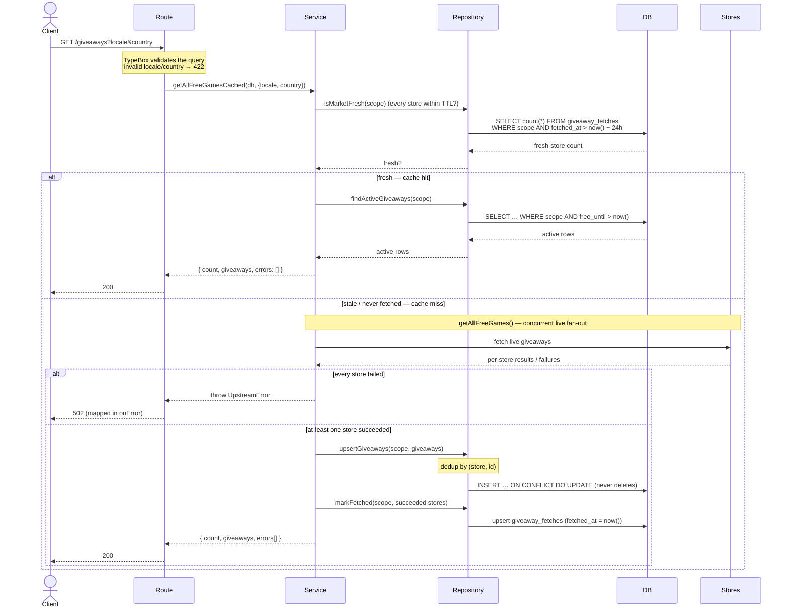

# Giveaways request flow

`GET /giveaways*` is a **read-through cache** over Postgres. A read serves the active cached rows when the
requested scope is fresh (fetched within `CACHE_TTL_HOURS`, 24h); on a miss it fetches live, writes the result
to the cache, and serves it. There is no separate refresh endpoint — the cache fills lazily on reads. See
[`architecture.md`](./architecture.md) for the file layout.

**Participants** (each maps to a file in `packages/api/src/modules/giveaways/`):

| Diagram name | Code |
| --- | --- |
| Route | `index.ts` — Elysia plugin: routing, TypeBox validation, 502 mapping |
| Service | `service.ts` — read-through cache + live fan-out |
| Repository | `repository.ts` — SQL queries + row↔API mappers |
| DB | Postgres — `giveaways` (rows) + `giveaway_fetches` (per-store TTL markers) |
| Stores | the storefront adapters under `stores/*` calling Epic / Prime / GOG / Steam |

## `GET /giveaways` (and `GET /giveaways/:store`)

The per-store endpoint is identical except the scope carries a single `store`: freshness is checked for that
one store (`isFresh`), and a miss fetches only that store.

Notes:

- **Writes on read** — a miss writes to the DB (upsert + fetch marker); this is intentional (read-through).
- **Retention** — rows are never deleted; giveaways past their `free_until` are simply filtered out, so the
  table also retains a history. A store fetched with zero giveaways still gets a `giveaway_fetches` marker, so
  it's served empty from cache instead of re-fetched.
- **Partial failure** — only the stores that succeeded are cached and marked fresh, so a still-failing store is
  retried on the next request (self-healing); its error is surfaced in `errors` on the miss path.
- **Staleness** — within the 24h window a brand-new upstream giveaway may not appear until the TTL triggers a
  re-fetch; an ended giveaway drops out immediately via the `free_until` filter.
