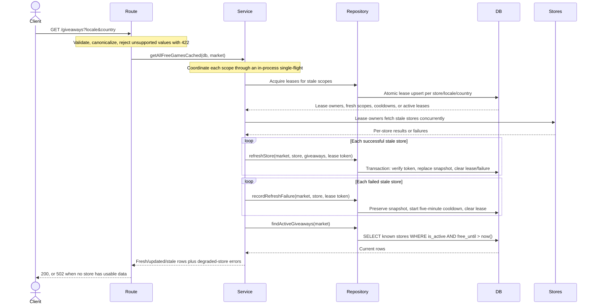

# Giveaways request flow

`GET /giveaways*` is a read-through cache over Postgres. Cache scopes are independent per store,
locale, and country, with a 24-hour TTL. Supported locale/country inputs are canonicalized before
they reach an upstream or become cache keys.

| Participant | Code |
| --- | --- |
| Route | `index.ts` - query validation and HTTP error mapping |
| Service | `service.ts` - per-store freshness and upstream orchestration |
| Repository | `repository.ts` - refresh leases, transactional snapshots, and row/API mapping |
| DB | `giveaways` history plus `giveaway_fetches` freshness, failure, and lease state |
| Stores | `stores/*` upstream adapters |

## Aggregate request

## Refresh semantics

- Upstream response bodies are streamed with a 5 MiB decoded-size limit before HTML or JSON
  parsing; declared and undeclared oversized bodies fail the store refresh.
- Upstream I/O, shape validation, and external URL normalization finish before the database
  transaction starts. Only credential-free HTTP(S) URLs are persisted; unsafe or malformed URL
  fields become `null`.
- A successful empty response deactivates the previous store snapshot and advances its marker.
- A giveaway omitted by the latest response remains in the table with `is_active = false`.
- A returning giveaway is reactivated, keeps `first_seen_at`, and advances `last_seen_at`.
- A failed upstream is not written or marked fresh. Its last successful snapshot remains active and
  is served when its giveaway window has not expired.
- Failed scopes are retried after a five-minute cooldown rather than on every request.
- Concurrent refreshes share one promise within a process. A token-guarded 60-second database lease
  prevents multiple replicas from fetching the same scope; expired leases can be reclaimed safely.
- A database failure rolls back deactivation, upserts, and the freshness marker together.
- Per-store endpoints use the same coordinated refresh path but check and fetch only one store.
