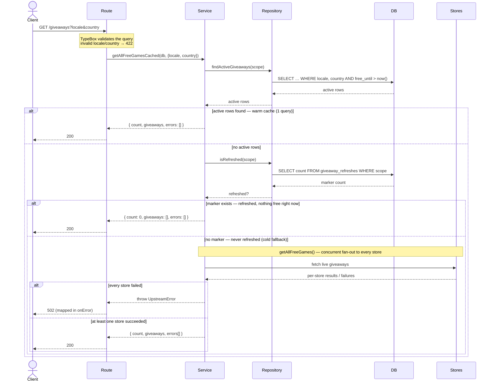
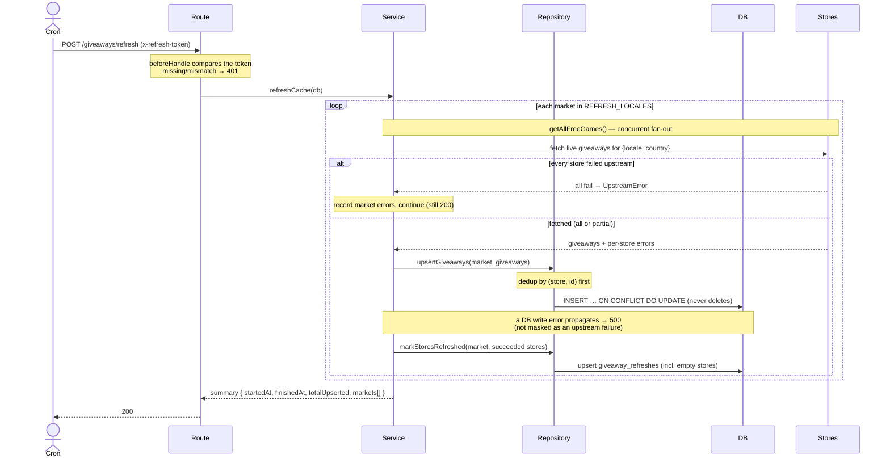

# Giveaways request flow

How the `giveaways` module serves requests. `GET /giveaways*` reads from the Postgres cache (falling back to a
live upstream fetch only for a market that has never been refreshed), and a cron-triggered
`POST /giveaways/refresh` populates that cache. See [`architecture.md`](./architecture.md) for the file layout.

**Participants** (each maps to a file in `packages/api/src/modules/giveaways/`):

| Diagram name | Code |
| --- | --- |
| Route | `index.ts` — Elysia plugin: routing, TypeBox validation, 502/401 mapping |
| Service | `service.ts` — cache reads + live fan-out + refresh orchestration |
| Repository | `repository.ts` — SQL queries + row↔API mappers |
| DB | Postgres (`giveaways` + `giveaway_refreshes` tables) |
| Stores | the storefront adapters under `stores/*` calling Epic / Prime / GOG / Steam |

## Read: `GET /giveaways` (and `GET /giveaways/:store`)

The per-store endpoint is identical except the scope carries a single `store` and the live fallback / response
envelope are for that one store.

Because rows are never deleted, `free_until > now()` alone decides "free right now", and the separate
`giveaway_refreshes` marker — not the row count — is what distinguishes "refreshed but empty" from "never
refreshed". That keeps a legitimately empty store (e.g. Steam with no promo) served from cache instead of
live-fetching on every request.

## Refresh: `POST /giveaways/refresh` (cron-triggered)

Upstream failures are expected and recorded per market (the request still returns `200` with a summary); a
database write failure is infrastructure-level and propagates so the endpoint returns a non-2xx a monitor can
act on. A store that succeeds — even with zero giveaways — is marked refreshed, which is what makes the read
path's "refreshed but empty" branch reachable.
